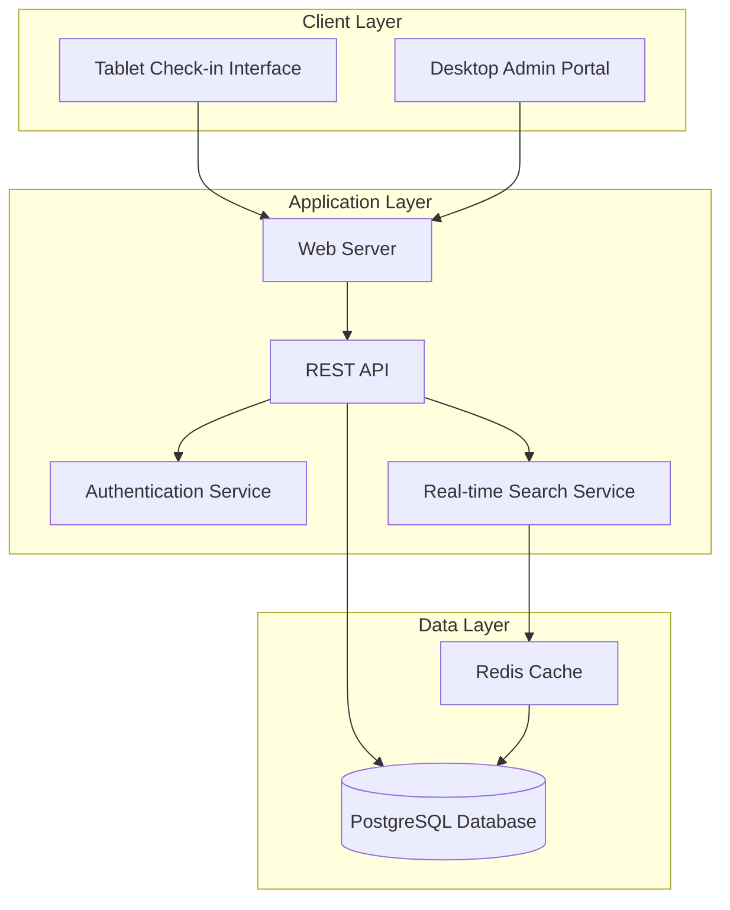

# Design Document

## Overview

The Worker Check-In System is a dual-interface web application built with a modern tech stack optimized for both tablet-based worker interactions and desktop-based administrative functions. The system uses PostgreSQL for data persistence, implements real-time search capabilities, and provides comprehensive event management and reporting features.

## Architecture

### System Architecture



### Technology Stack

- **Frontend**: React.js with TypeScript for component-based UI
- **Backend**: Node.js with Express.js for API server
- **Database**: PostgreSQL for primary data storage
- **Caching**: Redis for search optimization and session management
- **Authentication**: JWT tokens for admin sessions
- **Styling**: Tailwind CSS for responsive design
- **Build Tool**: Vite for fast development and optimized builds

## Components and Interfaces

### Frontend Components

#### Tablet Check-in Interface
- **CheckInLanding Component**: Landing page with "Returning Worker" and "New Worker" buttons
- **SearchWorker Component**: Real-time search with debounced input (for returning workers)
- **WorkerProfile Component**: Display search results with identification info
- **NewWorkerForm Component**: Registration form with validation (for new workers)
- **CheckinQuestions Component**: Three-question flow with different input types
- **TermsAgreement Component**: Terms display and acceptance
- **ConfirmationScreen Component**: Success message with auto-redirect

#### Desktop Admin Portal
- **Dashboard Component**: Real-time metrics and current event status
- **WorkerManagement Component**: CRUD operations for worker profiles
- **EventManagement Component**: Event CRUD with JSON import functionality
- **CheckinManagement Component**: View and manage check-in records
- **ReportingComponent**: Filters, analytics, and export functionality
- **SettingsComponent**: Terms editor and system configuration

### API Endpoints

#### Public Endpoints (No Authentication)
```
GET /api/workers/search?q={query} - Real-time worker search
POST /api/workers - Create new worker profile
POST /api/checkins - Record worker check-in
GET /api/events/active - Get current active event
GET /api/settings/terms - Get current terms and conditions
```

#### Admin Endpoints (Authentication Required)
```
POST /api/auth/login - Admin authentication
GET /api/admin/dashboard - Dashboard metrics
GET /api/admin/workers - List all workers with pagination
PUT /api/admin/workers/:id - Update worker profile
DELETE /api/admin/workers/:id - Delete worker profile
GET /api/admin/events - List all events
POST /api/admin/events - Create new event
POST /api/admin/events/import - Import events from JSON
PUT /api/admin/events/:id/active - Set event as active
GET /api/admin/checkins - List check-ins with filters
PUT /api/admin/checkins/:id - Update check-in record
DELETE /api/admin/checkins/:id - Delete check-in record
GET /api/admin/reports/export - Export reports (CSV/Excel)
PUT /api/admin/settings/terms - Update terms and conditions
```

## Data Models

### Database Schema

```sql
-- Workers table
CREATE TABLE workers (
    id SERIAL PRIMARY KEY,
    first_name VARCHAR(100) NOT NULL,
    last_name VARCHAR(100) NOT NULL,
    date_of_birth DATE NOT NULL,
    email VARCHAR(255) UNIQUE NOT NULL,
    phone VARCHAR(20) UNIQUE NOT NULL,
    street_address VARCHAR(255) NOT NULL,
    city VARCHAR(100) NOT NULL,
    state VARCHAR(100) NOT NULL,
    zip_code VARCHAR(20) NOT NULL,
    country VARCHAR(100) NOT NULL,
    created_at TIMESTAMP DEFAULT CURRENT_TIMESTAMP,
    updated_at TIMESTAMP DEFAULT CURRENT_TIMESTAMP
);

-- Events table
CREATE TABLE events (
    id SERIAL PRIMARY KEY,
    name VARCHAR(255) NOT NULL,
    start_date DATE NOT NULL,
    end_date DATE NOT NULL,
    location VARCHAR(255) NOT NULL,
    is_active BOOLEAN DEFAULT FALSE,
    created_at TIMESTAMP DEFAULT CURRENT_TIMESTAMP,
    updated_at TIMESTAMP DEFAULT CURRENT_TIMESTAMP
);

-- Check-ins table
CREATE TABLE checkins (
    id SERIAL PRIMARY KEY,
    worker_id INTEGER REFERENCES workers(id) ON DELETE CASCADE,
    event_id INTEGER REFERENCES events(id) ON DELETE CASCADE,
    timestamp TIMESTAMP DEFAULT CURRENT_TIMESTAMP,
    question_1_response VARCHAR(255) NOT NULL,
    question_2_response BOOLEAN NOT NULL,
    question_3_response_1 VARCHAR(255) NOT NULL,
    question_3_response_2 VARCHAR(255) NOT NULL,
    terms_accepted BOOLEAN DEFAULT TRUE,
    created_at TIMESTAMP DEFAULT CURRENT_TIMESTAMP,
    UNIQUE(worker_id, event_id)
);

-- Admin settings table
CREATE TABLE admin_settings (
    id SERIAL PRIMARY KEY,
    setting_key VARCHAR(100) UNIQUE NOT NULL,
    setting_value TEXT NOT NULL,
    updated_at TIMESTAMP DEFAULT CURRENT_TIMESTAMP
);

-- Indexes for performance
CREATE INDEX idx_workers_email ON workers(email);
CREATE INDEX idx_workers_phone ON workers(phone);
CREATE INDEX idx_workers_search ON workers(first_name, last_name, email);
CREATE INDEX idx_checkins_worker_event ON checkins(worker_id, event_id);
CREATE INDEX idx_checkins_timestamp ON checkins(timestamp);
CREATE INDEX idx_events_dates ON events(start_date, end_date);
```

### TypeScript Interfaces

```typescript
interface Worker {
  id: number;
  firstName: string;
  lastName: string;
  dateOfBirth: string;
  email: string;
  phone: string;
  streetAddress: string;
  city: string;
  state: string;
  zipCode: string;
  country: string;
  createdAt: string;
  updatedAt: string;
}

interface Event {
  id: number;
  name: string;
  startDate: string;
  endDate: string;
  location: string;
  isActive: boolean;
  createdAt: string;
  updatedAt: string;
}

interface CheckIn {
  id: number;
  workerId: number;
  eventId: number;
  timestamp: string;
  question1Response: string;
  question2Response: boolean;
  question3Response1: string;
  question3Response2: string;
  termsAccepted: boolean;
  createdAt: string;
}

interface CheckInRequest {
  workerId: number;
  eventId: number;
  question1Response: string;
  question2Response: boolean;
  question3Response1: string;
  question3Response2: string;
  termsAccepted: boolean;
}
```

## Error Handling

### Client-Side Error Handling
- **Network Errors**: Display user-friendly messages with retry options
- **Validation Errors**: Real-time field validation with clear error messages
- **Duplicate Check-in**: Prevent submission and show appropriate messaging
- **Search Failures**: Graceful degradation with manual entry options

### Server-Side Error Handling
- **Database Constraints**: Catch unique constraint violations and return meaningful errors
- **Authentication Failures**: Return 401 status with clear messaging
- **Validation Errors**: Return 400 status with field-specific error details
- **Server Errors**: Log errors and return generic 500 messages to clients

### Error Response Format
```typescript
interface ErrorResponse {
  success: false;
  error: {
    code: string;
    message: string;
    field?: string;
  };
}
```

## Testing Strategy

### Unit Testing
- **Frontend Components**: Jest and React Testing Library for component behavior
- **API Endpoints**: Jest with supertest for endpoint functionality
- **Database Models**: Test CRUD operations and constraint validations
- **Business Logic**: Test duplicate prevention and event selection logic

### Integration Testing
- **API Integration**: Test complete request/response cycles
- **Database Integration**: Test with actual PostgreSQL instance
- **Authentication Flow**: Test admin login and session management
- **Search Functionality**: Test real-time search with various inputs

### End-to-End Testing
- **Check-in Flow**: Complete worker check-in process from search to confirmation
- **Admin Workflows**: Event management, reporting, and worker administration
- **Cross-Device Testing**: Tablet interface on actual tablet devices
- **Performance Testing**: Load testing for concurrent check-ins

### Test Data Management
- **Seed Data**: Consistent test datasets for development and testing
- **Database Cleanup**: Automated cleanup between test runs
- **Mock Services**: Mock external dependencies for isolated testing

## Performance Considerations

### Real-time Search Optimization
- **Debounced Input**: 300ms delay to reduce API calls
- **Redis Caching**: Cache frequent search results
- **Database Indexing**: Optimized indexes for search queries
- **Result Limiting**: Limit search results to top 10 matches

### Database Performance
- **Connection Pooling**: Efficient database connection management
- **Query Optimization**: Use prepared statements and efficient queries
- **Pagination**: Implement pagination for large datasets
- **Archival Strategy**: Archive old check-in data to maintain performance

### Frontend Performance
- **Code Splitting**: Lazy load admin portal components
- **Image Optimization**: Optimize any images for tablet display
- **Bundle Size**: Minimize JavaScript bundle size for faster loading
- **Caching Strategy**: Implement appropriate browser caching headers